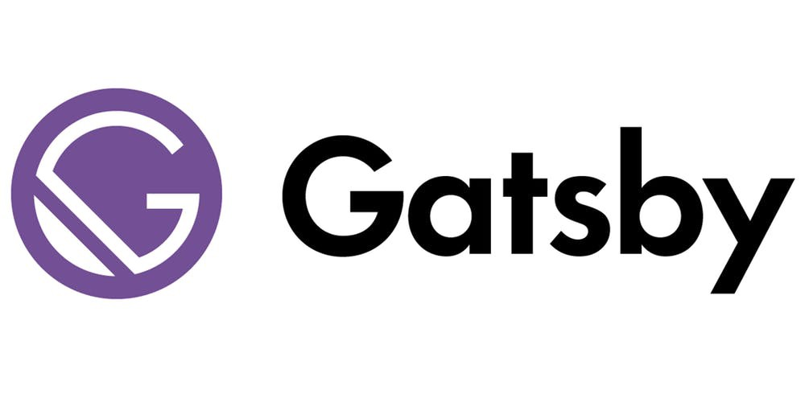
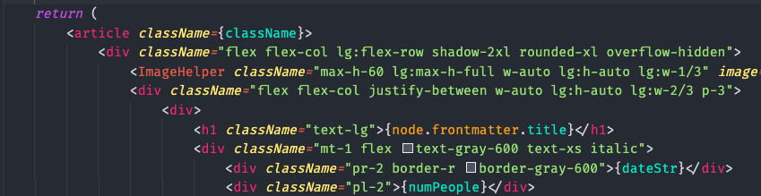

Soon after my exams, in late January, I was brainstorming various project ideas in order to pick one to do in my free time before the 2nd semester started. I wanted something simple, interesting, that could be useful in the future and that would help me expose myself to the world.

Then I came across [this post](https://dev.to/mouhamedaly/how-i-created-my-blog-with-gatsby-1762), and this quote:

> As a software developer, one of the best mediums you can use to market yourself is a blog. It’s my firm belief that every software developer who cares about their career should invest in creating a blog.

These words are from [John Sonmez](https://twitter.com/simpleprogrammr), software developer and author of two best selling books on tech and career development.

I had already come across the idea of building a personal blog, but this reminded me the importance of it, and made me realize that it ticked out all the requirements that I had for a side project. So I decided to do it.

In this article I will talk about why you may want to build your own personal website or blog, and how you can do it easily using [Gatsby](https://www.gatsbyjs.com/).

# Why would you build a personal website?

John Sonmez, alongside a lot of other people, talks a lot about blogging and how it is important. 
Writing articles on various topics like tech, career, self-improvement or your favorite hobbies (anything really) can help you better understand a certain concept and also help you be a better communicator, as there is a lot of researching and learning behind a blog post.

It can serve as a way to understand and learn about a certain topic; a good way of making sure you understand or know something is to explain it to other people. At the same time, it also serves as a way to pass the knowledge that you have to others and give back to the community.

If you are a freelancer or an independent consultant, it can also be helpful, as it can bring a lot of clients and customers your way instead of letting them simply find you by themselves. It pushes you to expose yourself to others, increase your networking skills and meet new people.

But you may ask yourself, *"Why should I waste time on having my own blog when I can simply post on already established platforms like [Medium](https://medium.com/) or [DEV](https://dev.to/)?"*

There are several reasons for having your own platform:

* You will not be dependent on any other platform. You own it and you have the freedom to do what you want;
* The website is *yours*: you can customize it and make it look and function according to your needs and likes;
* You can monetize your blog in the future, if you want, with ads for example;
* You can still publish on platforms like Medium or DEV, and redirect readers to your personal blog!

For me, besides all the reasons stated above, I took this as an **opportunity to start a new Web project**, so for those of you who are interested in having a small side project in Web Development, this can help you with that 😁

If that convinced you to maybe try to build your own personal site or blog, I will explain how I did it in the next sections, and how you can too.

# The technologies/tools I used

## Gatsby

To put it concisely, **"[GatsbyJS](https://www.gatsbyjs.com/) is a [React](https://reactjs.org/)-based, [GraphQL](https://graphql.org/) powered, static site generator"** (taken from [this post](https://www.mediacurrent.com/blog/what-is-gatsbyjs/)). It uses powerful pre-configuration to build a website that uses only static files (meaning it delivers the same files for all users/visitors) for incredibly fast page loads.

### What makes Gatsby special?

There were some aspects that made me choose Gatsby for developing my personal blog, as opposed to something like [Jekyll](https://jekyllrb.com/) or just using [React](https://reactjs.org/) or any other web technology.

The first thing to mention is its use of GraphQL. Gatsby uses GraphQL to collect your data from wherever it may be: Markdown, JSON, third party APIs, anywhere! At build time, it creates an internal GraphQL server of all of this data. So, in your React components, all of your data is queried at build time from there.

Secondly, despite not being around for too long (release in 2017), it has great documentation to help you get acquainted quickly. It also has a lot of different [plugins](https://www.gatsbyjs.com/plugins) that add functionality and help you customize your site.

And last but not least, is its dedication to performance, as I've mentioned earlier. Gatsby loads only the critical HTML, CSS, JavaScript and data so your site loads as fast as possible. Once loaded, Gatsby prefetches resources for other pages so clicking around the site feels really fast.

### Do I need to know React and GraphQL to use Gatsby?

One of the things I should mention here is that you do not need to know React and GraphQL beforehand in order to use Gatsby. Yes, having some React knowledge won't hurt you, but due to the great documentation and tutorials that Gatsby has available, I'm sure you will be just fine 😁

In my case, I had previous React experience but had never touched GraphQL before; I still got the hang of things pretty quickly after going through some of the tutorials. 

You can also use this project to your advantage if you want to learn these technologies but don't know where to start. I consider Gatsby a great point of entry to learn both React and GraphQL.

If you *really* can't wait any longer and want to get started right away, you can follow [this tutorial](https://www.gatsbyjs.com/docs/tutorial/part-zero/) and let your creativity fly. 

React and GraphQL are both crucial for Gatsby, but if you don’t know them, Gatsby is an excellent tool to learn them, and not an excuse not to.

### Some useful plugins that I use

Gatsby provides a lot of [plugins](https://www.gatsbyjs.com/plugins) that can massively extend the functionalities of your website; you should definitely look into this and use them to your advantage in order to create a unique product more easily. There are plugins for almost anything you can think of, from integrating Google Analytics to letting you use emojis in your blog posts 😉

Here is a collection of some plugins that I have on my blog, that can also be of use to you. 

* [gatsby-plugin-typography](https://www.gatsbyjs.com/plugins/gatsby-plugin-typography/) - plugin for utilizing the [Typography](https://kyleamathews.github.io/typography.js/) library with minimal configuration.
* [gatsby-transformer-remark](https://www.gatsbyjs.com/plugins/gatsby-transformer-remark/) - Parses Markdown files using [Remark](https://remark.js.org/), allowing you to display them in your website.
* [gatsby-remark-images](https://www.gatsbyjs.com/plugins/gatsby-remark-images/) - Processes images in Markdown so they can be used in the production build.
* [gatsby-remark-embed-video](https://www.gatsbyjs.com/plugins/gatsby-remark-embed-video/) - Embed a video from Youtube, Vimeo, etc for the ultimate Markdown experience.
* [gatsby-plugin-react-helmet](https://www.gatsbyjs.com/plugins/gatsby-plugin-react-helmet/) - Component which lets you control your document head using their React component. With this plugin, attributes you add in their component, e.g. title, meta attributes, etc. will get added to the static HTML pages Gatsby builds. This is important for SEO, which I will go over later on in this article.

## Tailwind CSS

In order to build this blog, I wanted to explore some frameworks and libraries that could aid me in the CSS department. I had heard about [TailwindCSS](https://tailwindcss.com/) before, but never used it and didn't know what it was about. So I decided to try it.

Since then, it has become my favorite CSS framework, and I will definitely use it in many other web projects. 

[TailwindCSS](https://tailwindcss.com/) is a low-level, customizable CSS framework that gives building blocks and common utility classes like `flex`, `pt-4` and `text-center`, as opposed to providing pre-designed components like [Bootstrap](https://getbootstrap.com/) does, for example.

To be fair, you don't really need a CSS framework for building your website/blog, since it is a fairly simple project, but if you want to, here are a couple of reasons why you may want to consider TailwindCSS:

* It is a utility-first CSS framework meaning that, instead of giving you pre-designed components like `card` or `carousel`, it provides you with low-level classes like `font-medium`, `rotate-90` and `rounded-full`. It gives you the opportunity to fully customize your site and make sure that it is unique and doesn't look like something that was "pre-defined" or "pre-built", which can happen if you use, for example, Bootstrap headers or cards.
* It's really easy to use, and you basically never have to leave your HTML. Here is a code snippet of one of the React components from this website:

* It helps you build a responsive website. It has special classes for defining different layouts and components at specific breakpoints, so you never have to write media queries. Example: using the classes `w-16`, `md:w-32` and `lg:w-48` on a specific component helps you define different widths for different screen sizes. It also provides other prefixes like `hover:` and `focus:`. Simple.
* Although Tailwind generates a lot of classes, it's build size is small in production, because it has the ability to purge and delete unused classes.
* It also has great documentation. [Take a look](https://tailwindcss.com/docs).

## Netlify

[Netlify](https://www.netlify.com/) is, to put it simply, a platform that offers cloud hosting and serverless backend services. I used it to deploy and host my blog. It's free, easy to use, and has many useful features. 

It enables **Continuous Deployment**, so anytime you push a new commit to your GitHub repository, Netlify automatically deploys the new version of your site. 

It also allows you to add security to your site with its Free SSL option with Let’s Encrypt. With one click install, HTTPS will instantly be available for your site.

## Namecheap

If you use Netlify, your site will be deployed with a domain name like mywebsite.netlify.com. To change it to something like a .com extension, like I did, you can use [Namecheap](https://www.namecheap.com/) to easily search and buy domains.

# Some things I had in mind

There were some things I had in mind and some decisions I made before and while building this project.

## Developing from Scratch

One thing that I decided to do from the beginning was to develop my website **from scratch**. I made this decision because I wanted to make my website unique and also use it as an opportunity to work on a web development side project, and I felt like using a template was kind of cheating.

However, if you want to spend less time coding and more time writing, Gatsby has a [good collection of templates](https://www.gatsbyjs.com/starters/?) that you can use to speed up the process 😃

## Optimize SEO

Another thing that I had in mind was that I needed to optimize the website's SEO before I made it public.

SEO stands for **Search Engine Optimization** and it involves the process of improving your site to increase its visibility for relevant searches. The better you optimize your blog for SEO, the higher your website will be listed on search engine result pages, so more people can find it.

Gatsby is SEO-friendly, because all pages are server side rendered and all content is available to search engine crawlers. However, to improve my blog's SEO even further, I used the [gatsby-plugin-react-helmet](https://www.gatsbyjs.com/plugins/gatsby-plugin-react-helmet/) plugin to build an SEO component that I added to all pages. You can do the same by following [this tutorial](https://www.gatsbyjs.com/docs/add-seo-component/).

The topic of SEO is quite an extensive one, and there are a lot of things that you can do to improve it and make sure your site is fully optimized for search engines, so I advice you to research a little more into it 🧐

# Things I want to do in the future

Even though I am currently happy with my blog, there are still some features on the backlog that I plan to eventually add. They could also be useful for your personal blog, or at least inspire you to think about other features that could be useful.

## PWA

PWAs, or **Progressive Web Applications**, are (among other things) web apps that behave like native apps. They have a defined set of pre-requisites like being responsive, have app-like interactions and being installable.

Gatsby already helps you with the majority of these things. You can use the [gatsby-plugin-manifest](https://www.gatsbyjs.com/plugins/gatsby-plugin-manifest/) to build a web manifest so users can add your site to their home screen on most mobile browsers.

## Adding Offline Support

One thing that would be useful and would go in hand with making your blog installable is to have an offline mode where users can navigate and read blog posts without being connected to the Internet. As you can imagine, there is also a plugin for that (Gatsby really is amazing). You can use the [gatsby-plugin-offline](https://www.gatsbyjs.com/plugins/gatsby-plugin-offline/) plugin to do just that.

## Tags

The majority of "blog" platforms where users can create posts and articles have tags that you can use in order to easily identify what are the main topics and subjects of a certain blog post. I feel like this is a useful feature and I intend to implement it on my personal blog in the future.

## RSS Feed

Finally, the last main feature that I have in mind for the future is to create an RSS feed for my blog posts and articles. An [RSS Feed](https://en.wikipedia.org/wiki/RSS) is a standard XML file listing a website’s content in a subscribable format, allowing readers to consume your content in news aggregators, also called feed reader apps. 

Subscribing to a website's RSS removes the need for the user to manually check the website for new content. Instead, their browser constantly monitors the site and informs the user of any updates.

You can do this with, you guessed it, a Gatsby plugin. [This Gatsby tutorial](https://www.gatsbyjs.com/docs/how-to/adding-common-features/adding-an-rss-feed/) helps you create an RSS feed using the [gatsby-plugin-feed](https://www.gatsbyjs.com/plugins/gatsby-plugin-feed/) plugin, so your users never miss a blog post.

# Conclusion

This was quite a long post, but I wanted to cover several topics. I wanted to explain why I think having a personal site and/or blog is beneficial for everyone, specially for software engineers and students, and that you can use it as a tool to expose yourself to the world and boost your career. We also went over how to get started building it using Gatsby and its incredible amount of plugins, how to create a unique design customized for your needs using TailwindCSS, and how to deploy and host your website in the end. We also went over some more advanced topics like SEO, RSS feeds and PWAs.

I hope this article was useful to you and that you learned something with it. Hopefully it inspired you to create your own website or blog, if you don't already have one. Thank you for reading and until next time 🤩

# References

* [How I Created My Blog With Gatsby](https://dev.to/mouhamedaly/how-i-created-my-blog-with-gatsby-1762)
* [Gatsby Official Website](https://www.gatsbyjs.com/)
* [What is GatsbyJS](https://www.mediacurrent.com/blog/what-is-gatsbyjs/)
* [Tailwind CSS Official Website](https://tailwindcss.com/)
* [Six Reasons Why You Should Start Using Tailwind CSS](https://codeburst.io/six-reasons-why-you-should-start-using-tailwind-css-402292c50a70)
* [Why Use Tailwind CSS for Your Next Project](https://dev.to/joserfelix/why-use-tailwind-css-for-your-next-project-39hp)
* [13 reasons why you should be using Netlify](https://dev.to/ogurinkaben/13-reasons-why-you-should-be-using-netlify-kgl)
* [Seriously though. What is a progressive web app?](https://medium.com/@amberleyjohanna/seriously-though-what-is-a-progressive-web-app-56130600a093)
* [RSS: Wikipedia](https://en.wikipedia.org/wiki/RSS)