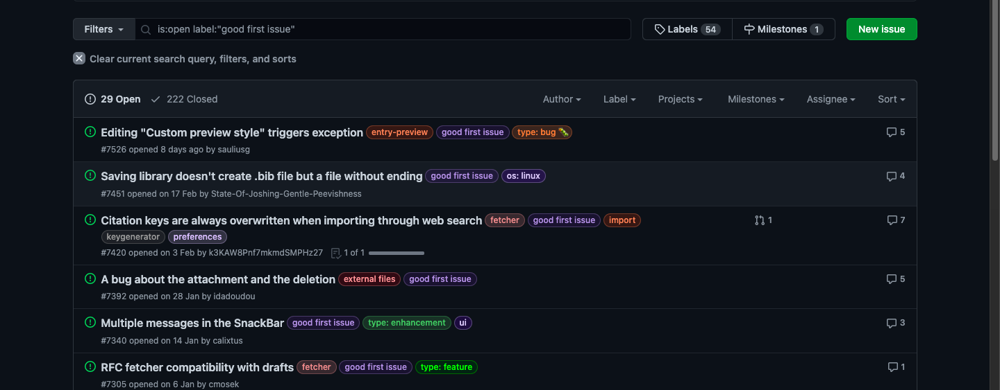
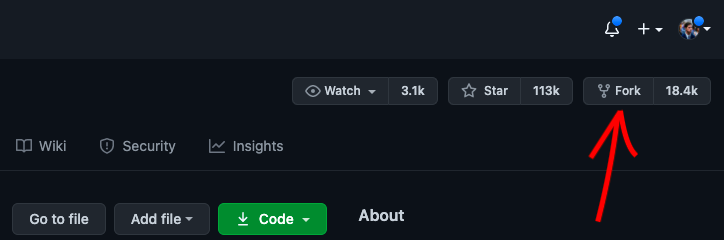
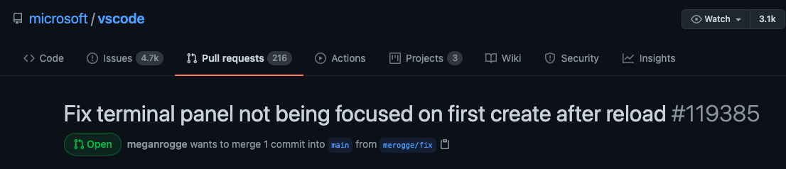
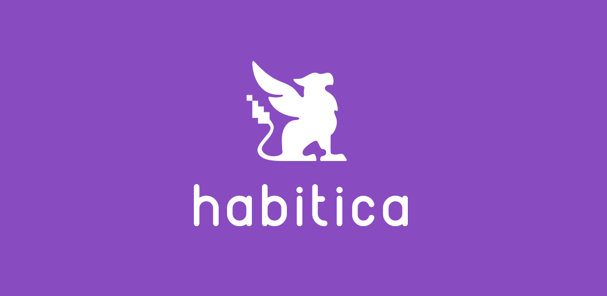
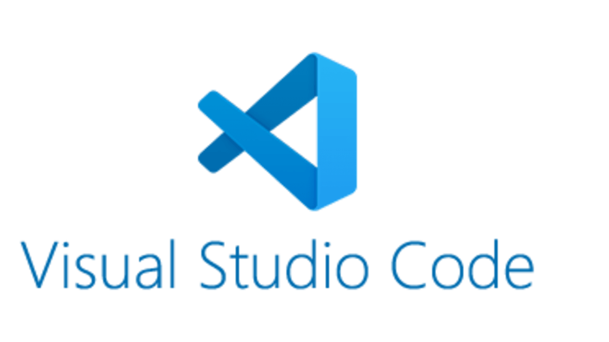

The concept of [open source software](https://opensource.com/resources/what-open-source) was introduced to me at the beginning of my software engineering journey, in my first year of university. In fact, my first ever college assignment was related to open source: I had to research about it and briefly present what it was all about. Unfortunately, first-year me didn't pay too much attention to it, but over time I started rediscovering this idea and began getting more interested in it. Lately, I've been doing some research, hoping to find some interesting open source projects to start contributing to, and I figured I might as well share my experience with you 😄

# What is Open Source?

> Open source software is software whose source code is publicly available and accessible for everyone to inspect, modify, and contribute.

In contrast, software that is private and that is only accessible to the people or organization who created it can be described as "closed source" software. **Skype is an example of closed source software.** It is completely owned by Microsoft and no other organization or person can access its source code, neither to view it nor to modify it.

But open source is different. Its authors use certain platforms, like [GitHub](https://github.com/home), to make the code publicly available, inviting others to not only use the code as they like (to view it, copy it, learn from it, etc), but to also propose changes and enhancements and introduce new functionalities. **An example of open source software is the Mozilla Firefox browser.** In most cases, open source software is free or at least provides a free version, however they often rival their closed source equivalents, which can cost hundreds of dollars or more.

As explained in this [article](https://opensource.com/resources/what-open-source), just like with closed source software, in order to use open source software the user must accept the terms of a license. However, open source licenses grant permission to use the software for any purpose or context.

By placing an open source license on a project, a person or organization agrees to:

* Make the entire source code available to anyone
* Allow anyone to modify and enhance the source code and the product
* Allow the creation of derivative works or other projects that build on top of it
* Allow the project to be utilized by anyone, for (pretty much) anything.

# Why is Open Source so important?

> "Open source licensing encourages innovation through collaboration. Without it, many of the technologies we take for granted today would never have developed, or would be locked away behind patent law. The open source movement is the reason that technology has developed at such a breakneck pace for the past few decades." - from *[What is open source, and why is it important?](https://www.bigcommerce.com/ecommerce-answers/what-open-source-and-why-it-important/)*

The concept of open source allows collaboration and partnerships that would otherwise not be possible. For example, a programmer in San Francisco might open a Pull Request, that would later be reviewed by someone in France, and commented by someone in Japan, while a solution is being proposed by someone in Finland... it lets knowledge and experience easily be shared among a community that can be comprised of people from all over the world. This movement is key for the overall advance of technology, and helps keep the world moving forward. 

Also, like it was previously mentioned, most of the time the software is completely free to use, however in terms of features and performance it can rival some other products in the same market, that are private and owned by a company and that can cost a lot of money. Open Source products sometimes are a cheap alternative for people who don't have the means.

# What are the advantages of contributing to Open Source projects?

Now let's think from a developer's perspective. As a software engineer or someone who is studying software engineering, why should you contribute to open source projects? Here is a list of topics that showcase the advantages that you can get from doing so:

* If you are new to software engineering or programming or just want to start a new project, this is an **excellent way to gain (early) experience, and it looks pretty nice on your CV**. It can be challenging at first, but remember you are not doing this alone, most project communities are active and have a lot of experienced users who already contributed a lot of times, who are ready to help newcomers if they have any questions.
* It **provides you what you can't get with small individual projects**: you can get experience with large codebases by contributing to real-life, big, production projects that are used by millions of people around the world.
* **No prior experience is needed** in order to start contributing to these projects. There are a lot of big, important projects, that label some of their issues as "Good First Issue" or "Beginner", etc, to attract new contributors and people who may not have a lot of experience. Open Source is for everyone!
* You collaborate with people who may have more experience than you. It is a **good way to learn more and increase your networking**. At the same time, you are able to **increase your recognition** on platforms like GitHub, for example.
* **You feel more accomplished and feel like you are doing something useful**, because once again you can be contributing to big projects that are actually used in real-life.
* **You feel part of a movement, and of something bigger?** Open Source software drives the world forward, it's innovation through collaboration. It is also a way to give back to the community. It's fun and gives you personal satisfaction.

# How can I contribute to an Open Source project?

If you have never contributed to an open source project, and don't know how to, fear not! The process is standardized over pretty much every project, so if you found an interesting one that you would like to be involved in, here is what you should do:

* **Read the contribution guidelines.** Most of the time, open source projects have in their repository what is called the contribution or coding guidelines. This is normally a document written in Markdown, or a web page, that describes what you should do to familiarize yourself with the codebase and to contribute to the project. Normally it has information about how to do a local setup of all the necessary technologies, the description of methodologies or workflows that are being used (e.g. Git Flow), the coding style or any constraints that you need to have into account while coding, etc. So you should definitely check this out in the beginning.
* **Choose the issue you want to take care of.** In the project's repository, there is probably an Issues section that lists all of the currently open issues and tasks that one can choose to do in order to contribute to it. Pick one that you find interesting or that you feel like you can take care of. For beginners, **look for issues that have labels like "Good First Issue" or "Beginner" or similar.** Almost every medium/large project has issues for newcomers, so don't worry if it's your first time 🙂

* **Fork the repository.** Now that you have read the guidelines and found an interesting issue, you must fork the repository, in order to have a copy of the codebase that belongs to you and that you can directly change.

* **Create a branch to work on your issue.** In your fork, create a new branch; this is where you will write your code. The naming of the branch should take into account the project's guidelines, and the issue that you are focusing on.

* **Code away!** You will then write the best code of your life. Maybe.

* **Make a Pull Request.** Once you're done coding, you must make a Pull Request, with the source branch being the new branch that you created in your fork, and the destination branch being the master branch or develop branch on the original repository (it may depend on the guidelines, so if you are unsure you should take a look at it once again). Here is an example PR from the Visual Studio Code repository:

* **Get feedback.** Maybe your PR wasn't perfect and you made some mistakes, but that's okay! If there are things you should change or improve, other contributors and maintainers of the project will comment on your Pull Request and give indications on what you should change. Gather this feedback and make the necessary changes to your code.

* **Approvals!** Once your code is good enough and you have solved the issue you chose, other contributors will approve your Pull Request, so it can be merged into the main codebase. In the majority of open source projects, you need at least 2 approvals in order to make the merge into the destination branch.

* **Profit!** Congrats! You have just made your first contribution to an open source project! 🎉🎉🎉

# How do I pick an Open Source project to contribute to?

So, now you know what is Open Source, why it's beneficial for you to contribute to OS, and you also know step by step how you can do that. One big question remains: how to find that perfect product/repository to contribute to? I mean, there are *tons* of projects out there, but how can you find the right one to focus on, especially if it's your first time?

Firstly, it's important to mention that just because an open source project is big, does not mean someone with little experience cannot contribute to it! As I've said before, if you never contributed to open source before, **try to find issues that are tagged with "Good First Issue", "Beginner", "Newcomer" and similar.** It can also happen that the contribution guidelines of the project indicate what are the issue labels you should be looking for, if you are a beginner.

There are open source projects of all types, that use all types of languages: JavaScript, Java, C++, Python, Scala... there are web projects that use frontend frameworks like React, there's databases, widely used libraries, etc. Choose an area that interests you and that you want to get better at. In order to make a better contribution, My advise is to choose a project that uses languages or frameworks that you are already familiar with, but nothing is stopping you from getting out of your comfort zone and picking something you never used before! 👀

Despite all this, my main tip for choosing a project to contribute to is: **find a project that resonates with you**, that speaks to you personally, and that you find useful. Maybe you might even use it already. This way, not only you might already be familiarized with the concept of the project, but more importantly you will be more motivated to actually do the work and finish your contribution. It isn't uncommon for someone to decide to make a contribution to a project, only to lose interest later on and never submitting a Pull Request. So this part is really important! 😄

# Some good Open Source projects to contribute to

If you need some inspiration to pick a project, is a curated list of projects that you might find interesting:

## Elasticsearch

According to their [website](https://www.elastic.co/pt/what-is/elasticsearch), *"Elasticsearch is a free, open and distributed data search and analysis engine for all types of data, including textual, numeric, geospatial, structured and unstructured. [...]Known for its simple REST APIs, distributed nature, speed and scalability, Elasticsearch is the central component of Elastic Stack, a set of free and open tools for ingesting, enriching, storing, analyzing and visualizing data."*
* [Link to website](https://www.elastic.co/pt/what-is/elasticsearch)
* [Link to GitHub repository](https://github.com/elastic/elasticsearch)
* **Primary languages/technologies:** Java
* **Issue labels for beginners:** "good first issue"
* **Number of contributors:** 1595
* **Number of repository stars:** 54.2k

## Habitica

Habitica is a productivity app like no other. It's a habit tracker app that treats your goals like a Role Playing Game. Level up as you succeed, lose HP as you fail, earn money to buy weapons and armor.
* [Link to website](https://habitica.com/static/home)
* [Link to GitHub repository](https://github.com/HabitRPG/habitica)
* **Primary languages/technologies:** JavaScript, Vue, HTML, CSS, Node, Express, MongoDB 
* **Issue labels for beginners:** "good first issue"
* **Number of contributors:** 607
* **Number of repository stars:** 8.2k

## Visual Studio Code

If you are a programmer, chances are you already know what VSCode is, and you may even use it. VSCode is one of the most widely used IDEs, that was made by Microsoft but is now also one of the biggest open source projects.
* [Link to website](https://code.visualstudio.com/)
* [Link to GitHub repository](https://github.com/microsoft/vscode)
* **Primary languages/technologies:** TypeScript
* **Issue labels for beginners:** "first timers only"
* **Number of contributors:** 1385
* **Number of repository stars:** 113k

## freeCodeCamp

*"freeCodeCamp.org is a friendly community where you can learn to code for free. It is run by a donor-supported 501(c)(3) nonprofit to help millions of busy adults transition into tech. Our community has already helped more than 10,000 people get their first developer job. Our full-stack web development and machine learning curriculum is completely free and self-paced. We have thousands of interactive coding challenges to help you expand your skills."*
* [Link to website](https://www.freecodecamp.org/)
* [Link to GitHub repository](https://github.com/freeCodeCamp/freeCodeCamp)
* **Primary languages/technologies:** JavaScript, React, CSS, Node, D3.js
* **Issue labels for beginners:** "first timers only"
* **Number of contributors:** 4222
* **Number of repository stars:** 322k

## React.js

A declarative, efficient, and flexible JavaScript library for building user interfaces. Probably the most popular frontend framework today.
* [Link to website](https://reactjs.org/)
* [Link to GitHub repository](https://github.com/facebook/react)
* **Primary languages/technologies:** JavaScript
* **Issue labels for beginners:** "good first issue"
* **Number of contributors:** 1539
* **Number of repository stars:** 166k

## Node.js

Node.js is an open-source, cross-platform, JavaScript runtime environment. It executes JavaScript code outside of a browser.
* [Link to website](https://nodejs.org/en/)
* [Link to GitHub repository](https://github.com/nodejs/node)
* **Primary languages/technologies:** JavaScript
* **Issue labels for beginners:** "good first issue"
* **Number of contributors:** 2950
* **Number of repository stars:** 77.8k

## Jarvis

*"Jarvis is a simple personal assistant for Linux, MacOS and Windows which works on the command line. He can talk to you if you enable his voice. He can tell you the weather, he can find restaurants and other places near you. He can do some great stuff for you."*
* [YouTube video showing Jarvis](https://www.youtube.com/watch?v=PR-nxqmG3V8)
* [Link to GitHub repository](https://github.com/sukeesh/Jarvis)
* **Primary languages/technologies:** Python
* **Issue labels for beginners:** "difficulty/newcomer"
* **Number of contributors:** 149
* **Number of repository stars:** 1.9k

## Brave Browser

Desktop browser for macOS, Windows, and Linux.
* [Link to website](https://brave.com/)
* [Link to GitHub repository](https://github.com/brave/brave-browser)
* **Primary languages/technologies:** JavaScript
* **Issue labels for beginners:** "good first bug"
* **Number of contributors:** 67
* **Number of repository stars:** 8.7k

## Tensorflow

TensorFlow is an end-to-end open source platform for machine learning. It has a comprehensive, flexible ecosystem of tools, libraries, and community resources that lets researchers push the state-of-the-art in ML and developers easily build and deploy ML-powered applications.
* [Link to website](https://www.tensorflow.org/)
* [Link to GitHub repository](https://github.com/tensorflow/tensorflow)
* **Primary languages/technologies:** C++
* **Issue labels for beginners:** "stat:contributions welcome"
* **Number of contributors:** 2934
* **Number of repository stars:** 154k

## Godot Engine

Godot Engine is a feature-packed, cross-platform game engine to create 2D and 3D games from a unified interface. It provides a comprehensive set of common tools, so that users can focus on making games without having to reinvent the wheel.
* [Link to website](https://godotengine.org/)
* [Link to GitHub repository](https://github.com/godotengine/godot)
* **Primary languages/technologies:** C++
* **Issue labels for beginners:** "junior job"
* **Number of contributors:** 1383
* **Number of repository stars:** 37.3k

## Kubernetes

Kubernetes, also known as K8s, is an open source system for managing containerized applications across multiple hosts. It provides basic mechanisms for deployment, maintenance, and scaling of applications.
* [Link to website](https://kubernetes.io/pt/)
* [Link to GitHub repository](https://github.com/kubernetes/kubernetes)
* **Primary languages/technologies:** Go
* **Issue labels for beginners:** "good first issue"
* **Number of contributors:** 3044
* **Number of repository stars:** 75.5k

# Conclusion

Open Source projects are important not only for people who use them, as some of them can be a great cheap/free alternative to some paid products, but they are also very valuable for programmers and software engineers that want to gain experience and get their hands dirty on real-life, big, production projects. They are an easy way to gain experience, and I think more developers should be contributing to them.

Besides the projects that I mentioned above, I will leave you with two good resources that I found useful for me, so you can find even more open source projects that may interest you!

* [Awesome First PR Opportunities](https://github.com/MunGell/awesome-for-beginners): this repository contains a (pretty large) list of beginner-friendly open source projects, separated in different languages. You should definitely check it out! 
* [First Timers Only](https://www.firsttimersonly.com/): website that guides newbies and beginners on how to make their first open source contribution.

As always, I hope you learned something from this article, and until next time!

# References

* [What is Open Source?](https://opensource.com/resources/what-open-source)
* [4 Examples of Open Source Software](https://open.lib.umn.edu/informationsystems/chapter/10-4-examples-of-open-source-software/)
* [How Open Source Software Works](https://www.thebalancecareers.com/what-is-open-source-software-2071941)
* [What is Open Source, and why is it important?](https://www.bigcommerce.com/ecommerce-answers/what-open-source-and-why-it-important/)