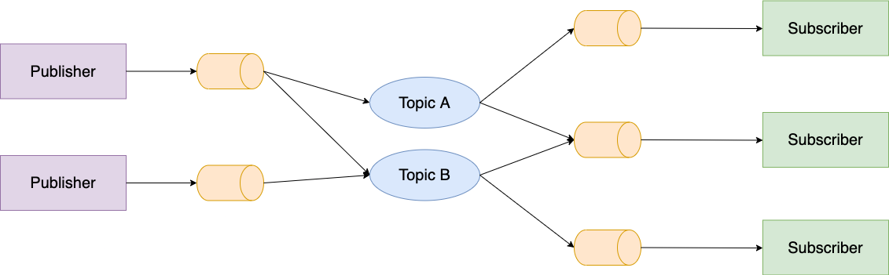

With the increase of complexity and the overall evolution of new systems and applications, communication between entities is no longer just the client making requests to a server. There are many situations that require the server to inform the clients of certain events, and in some cases that information might even be needed in real-time, with little to no delay.

Here are some examples of use cases that need real-time communication of updates, from the server to the client:

* **Messaging Apps.** Messaging applications let the user send messages to other users, and receive messages in real-time.
* **Stock Charting Platforms.** Applications that keep track of stock prices need to send events to the client-side in real-time, so the latest stock updates can be displayed in a web application, for example.
* **Multiplayer Games.** Online game servers need a way of sending to each user information about other users that are playing.

This process is not always easy, especially when the system needs to manage a large number of clients, which increases the importance of some concepts like scalability. Let's check out some ways of implementing real-time communication from a server to clients.

# HTTP Polling

Nowadays, the standard for client-server communication on the web is through the [HTTP](https://developer.mozilla.org/en-US/docs/Web/HTTP) protocol. The process is simple: the client starts the request, initiates the communication with the server, and asks it to either return some information or perform a certain action. When the server receives the request, it parses its content and returns a response to the client.

This process is appropriate for communication between systems, *when that communication is started by the client*. What if the communication needs to be started by the server, to give an update to the client?

It turns out we can in fact use HTTP requests to get updates from a server, using **HTTP Polling**. HTTP Polling consists of the client issuing an HTTP request to the server, asking if the server has any updates for it. If it doesn't, the server returns an empty response. If the server does in fact have something to give to the client, the client receives it as the response from its HTTP request. The client will continue to issue HTTP requests periodically, following a time interval, with the intent of collecting the most up-to-date information the server might have for it.

This approach is not very efficient, and has some heavy disadvantages:

* **Wastes resources.** Especially if the server updates are sparse, it can happen that the majority of requests made by the client are returned empty. Therefore, there is a large number of requests that are essentially useless and are just wasting resources. 
* **Can have a large delay.** Depending on the time interval used by the client to make requests, the information received from the server might not be the most up-to-date, and messages might be received with a delay basically as big as the time interval.

# HTTP Long Polling

Another solution that also uses HTTP requests and that solves some downsides of HTTP Polling is [HTTP Long Polling](https://www.pubnub.com/blog/http-long-polling/).
The difference in this approach is that after an HTTP request from the client, the server **saves and holds that request** until there is an update to be transmitted to the client. When that happens, the response is sent back to the client, and the client issues another request to the server, that will only return when the server generates the next update.

The disadvantages of HTTP Polling are somewhat mitigated. The overhead of issuing periodic HTTP requests is reduced by the server holding the requests and only returning if there are new updates. The message delays are also taken care of, because as soon as an update is generated, the server will respond to the currently stored request. So HTTP Long Polling can be used to implement real-time communication.

However, it still has some downsides, mainly when it comes to scalability. The server **needs to store connections for every client** that wishes to receive real-time updates, and if the number of users is large, that can be a problem. If the server events occur very frequently, then the number of HTTP requests from clients increases a lot.
Another problem is the need for a mechanism that prevents requests to be stored in the server indefinitely. It must be configured in a way so that connections do not stay alive permanently. This can be done with the use of **connection timeouts**, for example: after a certain amount of time, the server stops holding the request and sends back an empty response. It is then up to the client to issue a new request.

# WebSockets

[WebSocket](https://www.websocket.org/) is a standardized communication protocol that provides full-duplex communication (meaning that data can go both ways) over a single TCP connection. It enables **2-way communication between a web browser and a web server** with lower latency than polling, by setting up a **permanent connection between both** and allowing information to be sent in both directions. Both are capable of sending messages anytime. The connection stays open until any of the two explicitly finishes it.

Unlike HTTP Polling or Long Polling, by having a WebSocket connection between a client and a server we can have the server issue updates to the client without it being first requested by the latter.

WebSocket is distinct from HTTP, however it uses HTTP initially to setup the connection between the client and the server. That HTTP connection is then upgraded to a full-duplex permanent WebSocket connection.

A lot of applications that need real-time communication are using WebSockets, from online games like [agar.io](https://agar.io/) to messaging apps like [Slack](https://slack.com/).

The main advantages of using WebSockets are:
* **It is part of the HTML5 specification.** Basically all modern browsers support the use of WebSockets.
* It is **full-duplex**, so not only the server can send messages to the client, but the other way around can happen too. In contrast, the other solutions that we saw until now are only half-duplex, because the process needed to be started by the client.
* WebSockets are **not blocked by firewalls and traverse proxies**.
* It allows the implementation of other protocols and technologies on top of it, like **Publish & Subscribe** (which we will see next).
* It eliminates latency problems that may arise from Long Polling, especially if the server generates a lot of updates. There is only one permanent connection between each client and the server, with no need to issue requests and responses back and forth.

However, some downsides may still be visible in some systems:
* It may still be hard to scale on the server-side, because it will need to handle one open connection for each client.
* Now the client will also have an open connection at all times, and in less powerful devices that can be a problem (example: battery management on phones or IoT devices).

# Publish & Subscribe (Server-Sent Events)

[Publish-Subscribe](https://cloud.google.com/pubsub/docs/overview) is a messaging pattern in which the entities involved can be classified as either **publishers** or **subscribers**. Subscribers show interest in certain types of messages. Publishers produce updates and events and, when a certain message needs to be sent, they will send it to everyone who subscribed to that type of message.
Using this pattern, the publishers do not send the message explicitly to each subscriber, but instead classify the messages according to their type and send it to one or more data streams called **channels** or **topics**. This way, each publisher has no information about who are the subscribers (if any) that will receive the published message. Similarly, each subscriber is not aware of which publishers (if any) there are; they subscribe to channels/topics of interest, so they can be notified when a new message has been published by a publisher.

By using this pattern, publishers and subscribers are decoupled and do not communicate directly, only through channels. This way, each publisher does not need to maintain a connection with all the subscribers, and only needs to care about sending messages to the channel. Similarly, each subscriber only needs to listen to the channels of interest in order to get the latest updates.

In practice, there is often an intermediary layer called a **message broker**, that handles the distribution and filtering of the messages. Some popular message broker technologies are [RabbitMQ](https://www.rabbitmq.com/), [Apache Kafka](https://kafka.apache.org/), and the [AWS Amazon MQ](https://aws.amazon.com/pt/amazon-mq/). However, not every message broker is designed for real-time communication; some of them focus more on reliability and ordering of messages, for example.

So, how can we use the PubSub pattern to implement real-time communication from the server to the client?

The server will be the publisher: each event that is generated and that needs to be communicated will be encapsulated in a message and sent to the message broker. Every client is a subscriber and will be listening for events through the message broker, receiving them with little to no delay.

An advantage of using this approach for real-time communication is that **it is very scalable**. The server does not need to have a connection to every client, it only needs to send the events to the message broker. However, the message broker also adds more complexity, as it is another service that needs to be managed.
If we need full-duplex messaging, even though this can work the other way around if the server is a subscriber and the client is a publisher, an approach using WebSockets may be more advantageous.

# Honorable Mention: Webhooks

A [Webhook](https://en.wikipedia.org/wiki/Webhook) is a method of implementing a custom callback to some event. A server might provide a Webhook for a certain type of event, meaning that when that event happens, the custom callback is triggered. This custom callback comes in the form of an HTTP Request to some URL provided to that server, meaning that **when the event occurs, the server will issue a request to the given URL, providing information about it**.
While this can be used for client-server communication (browsers have a hacky way to have a JavaScript server running), it is most commonly used for server-server messaging.

# Conclusion

Nowadays, web applications and systems in general are becoming more and more complex. In an era governed by data, it is essential to know how to design a system that can present to the user large quantities of information in real-time. In this article, we have covered several ways to do that, using various technologies, protocols and approaches, and discussing their pros and cons.
As always, I hope you have learned something new with this, and that it motivated you to research more about this topic! See you next time 😃

# References

* [YouTube video: HTTP Request vs HTTP Long-Polling vs Websockets vs Server-Sent Events](https://www.youtube.com/watch?v=k56H0DHqu5Y)
* [WebSockets vs Long Polling](https://blog.intive-fdv.com/websockets-vs-long-polling/)
* [What is Publish-Subscribe (Pub/Sub)?](https://www.pubnub.com/learn/glossary/what-is-publish-subscribe/)
