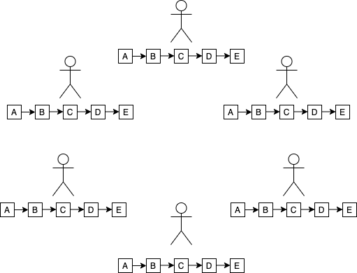

Blockchain feels like a term that many people have heard about, but some of them don't actually know what it is. There is a lot of misinformation about it.

I myself have had curiosity to learn what blockchain is for a long time, but never actually did so until recently, when I started working on a project that will use blockchain technology with smart contracts.

Blockchain has various applications, but the main one, and the one most people are familiarized with, is cryptocurrency. Now that cryptocurrencies are getting more popular, with Bitcoin hitting the 50k dollar mark, Ethereum 2.0 being developed and newcomers like Dogecoin on the rise, it is increasingly important to understand how the underlying technologies work.

# So... What is the Blockchain?

To put it concisely...

> Blockchain is a technology and architecture based on a distributed ledger, that allows various users to save information (data, transactions, contracts, etc) in blocks that are linked together, achieving a high degree of security and integrity.

The structure of a blockchain is essentially **append-only**, meaning that once you write data to the blockchain, it is extremely difficult to change it or delete it, whether if it's done with good or bad intentions. This is achieved by using [cryptographic hash functions](https://en.wikipedia.org/wiki/Cryptographic_hash_function) (among other things); they are used to calculate a unique hash or identifier for each block. But more on that later.

To understand why, we need to take a closer look at what each block contains: it contains its **hash**, the **data** inside it, and the **hash of the previous block** in the blockchain (they can contain more information depending on the application where the blockchain is actually being used, but essentially it is this). The fact that each block contains the hash of the previous one is actually what links the blocks together and makes the chain of block exist (thus the name blockchain).

The data that each block stores depends on the type of blockchain and application that is being considered. For example, in the case of a cryptocurrency, the blockchain would store in each block a set of transactions, each one containing information like the sender account, the receiver account, and the amount of coins transferred.

# Why is Blockchain so secure?

## Hash Calculation

As mentioned before, one of the aspects and characteristics of blockchain that makes it secure is its use of **hashing**.

> "Hashing is the process of converting a given key into another value. A hash function is used to generate the new value according to a mathematical algorithm. The result of a hash function is known as a hash value or simply, a hash. A good hash function uses a one-way hashing algorithm, or in other words, the hash cannot be converted back into the original key." - taken from [What is hashing?](https://www.educative.io/edpresso/what-is-hashing)

But how exactly is it used?

When a block is created, its hash is calculated based on the content of the block. If anything on the block changes, its hash is recalculated. 

So let's think about what would happen if someone tried to hack the contents of a block. If someone tries to, for example, change the value of a transaction in a block, its hash would change, since its content changed. Because of that, the next block in the blockchain, that had stored the hash of the previous block, now contains an invalid hash. This also applies to any change that the blockchain might suffer, including switching the order of blocks, deleting them, etc.

So essentially, the chain is broken, and all the blocks that follow the tampered block would actually need to get their hashes recalculated in order to restore the blockchain and make it valid again. 

The problem is... that's not that hard to do. Machines nowadays have enough computational power to calculate millions of hashes per second, so an attacker could just compute the hashes for all the blocks and make the chain valid again... How to prevent this?

## Proof of Work

> Proof of Work is a blockchain protocol for verifying transactions on a decentralized network and maintaining consensus across the system. Proof of Work is costly and time-consuming to produce, but easily verifiable by others.

Proof of Work, or PoW for short, is a mechanism/protocol that purposely slows down the creation of new blocks in order to prevent tampering from an attacker. It also avoids things like [DDOS](https://www.cloudflare.com/learning/ddos/what-is-a-ddos-attack/) and spam.

The computing power necessary to do the PoW depends on various factors and is configurable though what is called the **difficulty** of the PoW. This could be, for example, imposing that the calculated hash of the new block needs to **start with 10 zeros**. For each block, there is a random number (the **nonce**) that influences the result of the block hash. If the calculated hash for a block does not have 10 zeros, the nonce is incremented and a new hash is calculated for the block. The process is repeated until the hash does in fact have 10 zeros. This PoW may demand a lot of computing power because the number of hashes thats needs to be computed may be quite big, but at the same time it is easily verifiable by others: when someone wants to know if a block is valid, they simply take the block values, including the final nonce value, and compute the hash for the block. If the hash does start with 10 zeros, they can be extremely confident that whoever calculated the hash actually did the PoW correctly and that the block is valid.

In this case, the difficulty of the PoW can be modified by changing the number of desired leading zeroes; the more zeroes the hash needs to have at the start, the more difficult and laborious it is to compute a valid hash. In Bitcoins case, the difficulty of the PoW is managed so that it takes about 10 minutes to calculate the required PoW and to add that block to the blockchain. This makes the blockchain more secure because if you tamper with a block, you will need to redo the Proof of Work for all the following blocks.

## Distributed property of the blockchain

Apart from hashing and PoW, this is another aspect that makes blockchain so secure.

Let's take into account a blockchain system that has a set of participants or nodes, that perform transactions and create blocks to expand the blockchain. Instead of using a central entity to manage the blockchain, **each participant will instead keep a local copy of the blockchain**. When someone creates a block, they will broadcast it into the network so that other participants are aware of its existence. Each one will then check if the block is valid and if it has not been tampered with, and if it is in fact valid it is added to that participant's local copy of the blockchain. Therefore, nodes reach **consensus** about the node added and the new blockchain state.

This decentralized property of the blockchain could bring some additional challenges. Let's say you are a participant, and your local copy of the blockchain ends in block A. You receive a new block B, that connects to block A, thus extending the blockchain. However, some time later, you receive a block C, that also connects to block A. So know you have a **fork**, a separation that resulted in two different blockchains. What happens when you have a **conflict** and you have two distinct blockchains with conflicting transactions or data, like what happened in this case?

The rule to solve this situation is to trust the longest blockchain, **the one with the most work put into it.** Going back to the previous example, eventually we would receive some other blocks that would connect to block B, and maybe some blocks that connect to block C, thus extending both chains. After some time, these chains would probably have different lengths, and we would only keep the longest one, thus resolving the conflict and reaching consensus.

That is why it is almost impossible to tamper and hack a blockchain, specially if the number of participants and nodes is high: after tampering with a block, we would need to redo the PoW for all following blocks, and because of this **consensus algorithm** we would also need to have at least somewhere close to 50% of the computing power of the whole network, in order to continue computing PoW for new blocks, to maintain the blockchain with the tampered block the blockchain that everyone agrees on. If we do not have that computational power, eventually our tampered blockchain will not be the longest one and it will be discarded.

# The process of mining

Now that we have understood, from a high-level perspective, how a blockchain works and what are the main characteristics that make it so secure and reliable, let's discuss how new blocks actually get generated and added.

It can be the case that some users only want to make transactions or use the blockchain without the need of doing the PoW and computing a valid hash for a block. In the case of cryptocurrencies, if someone makes a transaction, they're not necessarily the one who create the block containing that transaction. So who actually does the PoW and generates new blocks?

Still on the cryptocurrency example, there is another problem related to it: where does the money come from? Seriously, how do I actually get my hands on some Bitcoins and how are new coins generated into the system?

To answer both of these questions, we need to understand the concept of **mining**.

Let's take Bitcoin as an example. Each time a new transaction is created, it gets added to the network. Some participants will be "listening" for transactions on the network, and they will group them together in a block, calculate the PoW necessary for the block to be considered valid, and broadcast it so other nodes can add it to their blockchain. This process has the name of **mining** and the participants who do it are called **miners**.

As a reward for completing this process, miners get a small quantity in Bitcoin, thus introducing new bits of currency into the economy.

This mining process might be compared to some kind of mini lottery: when a block is created, various miners will compete at the same time in order to perform the PoW and compute a valid hash for the block. Whichever miner completes the PoW first will get the reward for it.

# What are the main advantages that blockchain offers?

* **Immutability:** As said before, the structure in a blockchain is append-only, meaning that you cannot alter or delete data or blocks.
* **Security:** It is extremely secure due to the use of cryptographic hash functions, the PoW protocol and the consensus algorithm.
* **Decentralization:** It does not have a centralized architecture; each participant keeps a copy of the blockchain. Because of that, data that is lost in a node is easily recoverable.
* **Trustless:** The blockchain technology allows for verification without having to be dependent on third-parties.
* **Transparency:** The data present in the blocks is observable. The individuals who are provided authority can view the block's information.
* **Traceability:** Each block can be tracked along the chain to its point of origin. Usually, the blocks are time stamped and recorded in chronological order.

# What can blockchain be used for?

Some examples are:

* **Cryptocurrencies and payment processing:** The main use case for blockchain is the one you probably already know of, that is cryptocurrencies. Currencies like Bitcoin, Ethereum, Ripple, Litecoin, etc, all use the blockchain technology to function. But that is far from being the only application that blockchain has.
* **Data sharing:** Cryptocurrency [IOTA](https://www.iota.org/) launched, a few years ago, their Data Marketplace, demonstrating that blockchain could be used as a marketplace to share or sell data.
* **Supply chain and logistics monitoring:** By using blockchain, businesses should be able to quickly detect inefficiencies within their supply chains, as well as locate items in real time. Furthermore, it would allow businesses, and possibly even consumers, to view how products performed from a quality-control perspective.
* **Voting mechanism:** A blockchain solution would combine the best of both worlds, providing not only the transparency necessary to see all the votes and to detect if something has changed on the network, but also immutability (i.e. unchanging nature of the blockchain).
* **Medical recordkeeping:** In addition to storing patient records, the patient, who possesses the key to access these digital records, would be in control of who gains access to that data, thus strengthening patient privacy. 
* **Property title transfers:** In order to buy or sell land, a house, a car, etc, you will need to transfer or receive a title. Blockchain can store titles on its network, providing a transparent view of this transfer and presenting a clear picture of legal ownership.

Among many others!

# Challenges that blockchain faces

Even though blockchain is a very promising technology with a lot of potential and various applications, it is far from perfect. It still has several flaws and bottlenecks that prevent its widespread adoption. Some of them are: 

* **Energy consumption and computational power:** The computational power required for a blockchain to operate can be quite expensive. According to [this article](https://www.computerworld.com/article/3191077/what-is-blockchain-the-complete-guide.html), "the Bitcoin blockchain harnesses anywhere between 10 and 100 times as much computing power as all of Google's serving farms put together". 
* **Scalability:** Big issue. Because of this, Bitcoin payments still take somewhere around 10 minutes to 1 hour. In order for blockchain to compete with payment networks and achieve adoption by FinTech companies, it must find a way to boost scalability and throughput, and address latency problems. For example, Bitcoin can only process 3.3 to 7 transactions per second, whereas Visa's VisaNet on average processes 1,700 transactions per second.
* **Limited interoperability:** Another challenge is the lack of interoperability between the large number of blockchain networks. Various projects are using blockchain platforms with different protocols and algorithms, and the lack of universal standards makes it difficult to communicate between networks.

# Conclusion

In this article we went over the very basics of blockchain, how it works, how it can be used, and what are its main advantages and problems. There are *a lot* of topics that this article did not cover, as blockchain is a very extensive topic. But hopefully it was enough to give you an idea of this technology.

You have probably noticed that the title of this article says "1 out of 2". That's because there will be a follow-up post to this one, that will cover another application of blockchain networks: **smart contracts**. Stay tuned for that 😉

Thank you for reading and until next time!

# References

* [But how does bitcoin actually work?](https://www.youtube.com/watch?v=bBC-nXj3Ng4&t=613s)
* [How does blockchain work](https://www.youtube.com/watch?v=SSo_EIwHSd4)
* [What is the Blockchain: Investopedia](https://www.investopedia.com/terms/b/blockchain.asp)
* [Blockchain: The Complete Guide](https://www.computerworld.com/article/3191077/what-is-blockchain-the-complete-guide.html)
* [A Shallow Dive Into Bitcoin's Blockchain](https://towardsdatascience.com/a-shallow-dive-into-bitcoins-blockchain-part-2-transactions-d4ee83067bae)
* [Top Advantages of Blockchain for Business](https://www.smartdatacollective.com/top-advantages-blockchain-for-businesses/)
* [20 Real World Uses for Blockchain Technology](https://www.fool.com/investing/2018/04/11/20-real-world-uses-for-blockchain-technology.aspx)
* [Remaining Challenges of Blockchain Adoption, and Possible Solutions](https://www.finextra.com/blogposting/18496/remaining-challenges-of-blockchain-adoption-and-possible-solutions)
