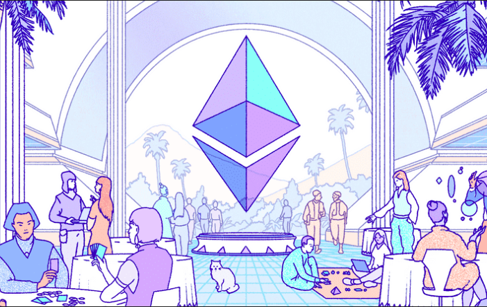

This is the second post of a 2-part series in which we talk about the concepts of blockchain and smart contracts, clarifying what they are, how they work, what they are for, and how they can shape the future.

The first part of the series talks about blockchain; it is important to be familiarized with the concept of blockchain in order to fully understand how smart contracts work, so it would be fantastic if you could go back and take a look at the [first post of the series](https://eduardocribeiro.com/blog/understand-blockchain/) 😉 Don't worry, I'll wait.

Oh? You're back? Did you read the blockchain article? Are you sure? Hm... 🧐

Okay, I trust you. Let's get started then 😄

# What is a Smart Contract?

Smart Contracts are actually not that recent: in 1994, cryptographer [Nick Szabo](https://pt.wikipedia.org/wiki/Nick_Szabo) came up with the idea of being able to **record contracts in the form of computer code**. The main advantage of his idea and this approach was that the contract would be **activated automatically when certain conditions are met**. It seemed promising, however, it was a new concept that was difficult to execute and put in practice, due to the technology that existed back then.

The idea of smart contracts was finally able to be properly **put into practice with the introduction of blockchain** in 2009, and the creation of the first blockchain-based smart contracts came in 2015, after [Vitalik Buterin](https://pt.wikipedia.org/wiki/Vitalik_Buterin) created [Ethereum](https://ethereum.org/en/). Besides currently being the second-largest cryptocurrency on the planet, it is also a **platform that allows other blockchain applications to be built on top of it**, providing you the ability to create your own smart contracts using [Ether](https://ethereum.org/en/eth/), their currency.

So, to put it concisely:

> A smart contract is a computer program or a transaction protocol, which represents an agreement between two people or entities. They run entirely on the blockchain, and all transactions are processed there, without the need of a third party. The transactions only occur after the conditions in the agreement are met, and when that happens, they are performed automatically.

It can be seen as a kind of **if-then statement**: if and only if a certain condition is met, then the transaction or payment is executed. When that "if" condition is validated, the "then" statement is automatically executed, and there is no chance for changing or tampering with these contracts. That "if" statement can be, for example, an expiration date.

# How exactly do smart contracts work?

Hopefully that gave you a better idea of what smart contracts are actually about, but let's try to understand exactly how they work. And for that, nothing better than a simple example 🙂

Let's say that Alice, who's been saving up for months, wants to buy Bob's car. Once they agree on a reasonable price, this agreement between both entities can be formed and saved in the Ethereum blockchain, for example, using a smart contract.

Bob has agreed with Alice that **she needs to pay him 30 Ether** in order for her to have the car.

The smart contract can then be described, in a very simple fashion, as:

"IF Alice pays Bob 30 Ether, THEN Alice will receive full ownership of the car."

Alice and Bob then create the smart contract using the Ethereum platform.

Once this smart contract has been registered and put into place, **it cannot be changed**: there is no way that Alice can modify the contract and lower the price, and the same also applies to Bob, who cannot raise the price or change the benefits given to Alice after the payment.

Because of that, Alice can feel safe paying the 30 Ether to Bob, because she knows that she will for sure receive ownership of the car. Bob should be pretty relaxed too: he knows that Alice will only get the benefits if she pays the agreed fee of 30 Ether.

Now, let's think about what would need to happen if Alice and Bob did not decide to use a smart contract, and rather opted for the old-fashioned way.

Without the use of a smart contract, they would need to pay lots of fees to third-party companies, including the bank, a lawyer and a vehicle broker. The whole process would also take fairly longer to conclude, as opposed to using smart contracts: in that case, after Alice completes the payment, the transition of ownership would be automatic and immediate.

## What is happening behind the scenes?

It all revolves around **blockchain technology**. The main advantages and characteristics of the blockchain are the keys to putting the idea of smart contracts in practice.

As mentioned in my previous post, blockchain platforms are **decentralized**, so they can be used to decentralize smart contracts and make them trustless, removing control from any central party (like banks, government, etc).

Smart contracts on the blockchain also take advantage of **immutability** and **security**, making them near impossible to hack for the same reasons explained in my [blockchain post](https://eduardocribeiro.com/blog/understand-blockchain/) (it's still a good time to check it out! 👀). It is also a **transparent** and **traceable** process, meaning that all the information about the contract is easily accessible by the participants.

# What are the main advantages and disadvantages of smart contracts?

To summarize...

* **Autonomy** – You are the one who makes and controls the agreement, and as it was said, it executes automatically and immediately on the blockchain, eliminating the need for third parties as intermediaries.
* **Reduced cost** – Speaking of third parties, since they are not necessary when using smart contracts, you save all the money that would otherwise be used on lawyers, brokers, etc.
* **Safety/Trust** – All the safety and security mechanisms of the blockchain play in the favor of smart contacts, to make an unmodifiable and immutable solution.
* **Speed** – Smart contracts on the blockchain are automated, shaving a lot of time when compared to a more traditional process with lots of paperwork involved.
* **Transparency** – The conditions on the contract are visible and easily accessible by the participants.
* **Reliability** – Since the smart contract is saved on various nodes on the blockchain, your documents are never lost.
* **Accuracy** – Smart contracts are not only faster and cheaper, but they are also a good way to avoid any human mistakes that could've happened during the process.

However, they are not a perfect solution. Here are some challenges that come with the use of smart contracts:

* **Difficult to change** - The unmodifiable aspect of the blockchain and of smart contracts can be both a blessing and a curse. While it does provide security and safety, if for example there is an error on the code of the contract, the process of fixing that error can be time-consuming and expensive.
* **Translation into code** - Contracts can include terms that are not always fully understood. Smart contracts are not always able to handle terms and conditions that are vague.
* **Third parties** - This one may seem contradictory, since one of the main benefits of smart contracts is the elimination of third parties. However, the issue is more complicated than it seems. It may get rid of the need for brokers or other intermediaries to confirm the agreement, but sometimes, for example, lawyers may still be needed by developers to understand the terms in order to create the code for smart contracts. Third parties may assume different roles from the ones they take in traditional contracts.

Other problems may also arise, like legal issues related to how governments should regulate these contracts, how would they tax them, etc.

# How are smart contracts being currently used?

The scenario of buying/selling goods, like the example that was given earlier, when Alice bought Bob's car, can be a common use for smart contracts but it is far from being their only application. Smart contracts can be used for any type of transaction; it does not have to be financial.

Let's see how some industries can benefit from the use of smart contracts, and some cases where it's already being used:

* **Insurance Companies** - Some companies have already started using smart contracts as a way to implement insurance policies. For example, let's say take the example of guarantee insurance, that covers the loss that can arise from dishonesty, disappearance, etc. Essentially, it compensates customers if they do not receive a desired service or product. In this case, let's say that the insurance company creates a smart contract and sends $250 to it, and the customer sends $50, making a total of $300. If the customer does end up receiving the service or product, the smart contract sends the insurance company the $300, otherwise it would be sent to the customer in order to compensate for their loss. This approach saves time and money, and both parties can be 100% sure that if their condition is met, they will get the money automatically.
* **Supply Chain** - Supply chain is an area that suffers a lot from paper-based systems that slow down the process and introduce the risk of loss and fraud. Smart contracts can be used as a way to mitigate these issues. By providing a secure, digital version to all parties involved, and by automating tasks and payments, then we can do things like triggering the creation/order of a product in the supply chain after a delivery of some finished product at the end of the chain. 
* **Business Management** - One way that businesses can use smart contracts is to automate the payment of their employees. Examples can be as simple as "WHEN we reach the end of October, THEN send John 2 Ether". John will always be paid on time, no more no less, and the business does not need to worry about anything.
* **Healthcare** - Health systems can use smart contracts to safely store and transfer patient records, allowing no access to third parties. The patients are therefore given full control of their data: if, for example, researchers want to use their data, not only do they have to pay for it, but even then the final decision would be up to the patient, according to if they want to sell it or not.
* **Governments** - Smart contracts constitute a way to make voting systems less susceptible to manipulation. Moreover, it could increase the actual number of voters, because it contributes to eliminate or at least improve the slow process that is required in some countries for someone to vote.

# "Can I make a smart contract??"

If you liked the concept of smart contracts and want to get your hands dirty right away, fear not! Because getting started and creating your first smart contracts can be very simple.

Regarding the platform, unless you have any good reason not to, you should use the Ethereum blockchain. It is the most popular and the go-to option for building smart contracts and any application that relies on them. Smart contracts on the Ethereum blockchain can be written using their **special programming language for smart contracts**, named [Solidity](https://docs.soliditylang.org/en/v0.8.2/). Solidity is an object-oriented, high-level language, that is influenced by the likes of C++, Python and JavaScript, so if you already know some of these languages and are familiar with OOP concepts, learning Solidity shouldn't be too hard!

A great tool to get started with making smart contracts on Ethereum is [REMIX IDE](https://remix.ethereum.org/). REMIX IDE is a browser-based IDE that allows you to write Ethereum smart contracts without having to install anything on your computer.

After introducing the concept of smart contracts, Ethereum and Solidity, and the REMIX IDE, I now leave you a very simple tutorial on how to build your first smart contract using these tools and technologies, that I found useful for myself.

`youtube: https://www.youtube.com/watch?v=ooN6kZ9vqNQ`

# Conclusion

So that's it! That concludes the 2-part series that I have regarding blockchain and smart contracts, which I started working with recently and found very fascinating. They both have a lot of potential but there are some issues and challenges that need to be tackled before their mass adoption starts.

Hopefully you learned something with this, having given you the curiosity to take a deeper dive and explore more about these topics. Until next time!

# References

* [Smart Contract: Wikipedia](https://en.wikipedia.org/wiki/Smart_contract)
* [What Is a Smart Contract and How Does it Work?](https://www.bitdegree.org/crypto/tutorials/what-is-a-smart-contract)
* [Smart Contracts Definition: Investopedia](https://www.investopedia.com/terms/s/smart-contracts.asp)
* [Smart Contracts: The Blockchain Technology That Will Replace Lawyers](https://blockgeeks.com/guides/smart-contracts/)
* [Smart Contracts - Overview, Uses, Benefits, Limitations](https://corporatefinanceinstitute.com/resources/knowledge/deals/smart-contracts/)
* [What are Smart Contracts (Youtube Video)](https://www.youtube.com/watch?v=ZE2HxTmxfrI)